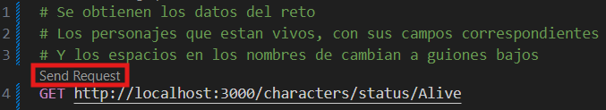
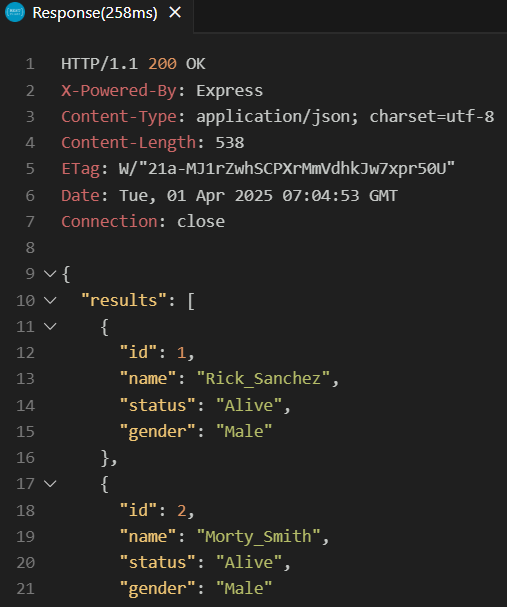

# Configuración del proyecto

```bash
$ npm install
```

## Compilar y correr el programa

```bash
$ npm run start
```

## Correr las pruebas

```bash
# unit tests
$ npm run test

# e2e tests
$ npm run test:e2e

# test coverage
$ npm run test:cov
```
## Probar la api
## Página web
https://prueba-tecnica-auronix-production.up.railway.app/
### Ruta del reto
https://prueba-tecnica-auronix-production.up.railway.app/characters/status/Alive
### Rutas para checar los otros estatus
https://prueba-tecnica-auronix-production.up.railway.app/characters/status/Dead
https://prueba-tecnica-auronix-production.up.railway.app/characters/status/unknown
### Ruta para obtener todos los personajes
https://prueba-tecnica-auronix-production.up.railway.app/characters/all
### Ruta para buscar a un personaje por su id
https://prueba-tecnica-auronix-production.up.railway.app/characters/id/1
#### Nota: Todas las rutas tienen los campos y el formato del nombre como dice en el reto
#### Nota: En caso de correr la aplicación en otro puerto que no sea 3000 cambia ese valor

## Entorno Local
Si estas en Visual Studio Code descarga la extension REST Client de Huachao Mao
Ve al archivo requests.http y da clic en Send Request





Si usas Postman al ser una aplicación en un entorno local necesitas descargar su aplicación o el Postman Agent
Las rutas son:
### Ruta del reto
http://localhost:3000/characters/status/Alive
### Rutas para checar los otros estatus
http://localhost:3000/characters/status/Dead
http://localhost:3000/characters/status/unknown
### Ruta para obtener todos los personajes
http://localhost:3000/characters/all
### Ruta para buscar a un personaje por su id
http://localhost:3000/characters/id/1
#### Nota: Todas las rutas tienen los campos y el formato del nombre como dice en el reto
#### Nota: En caso de correr la aplicación en otro puerto que no sea 3000 cambia ese valor
